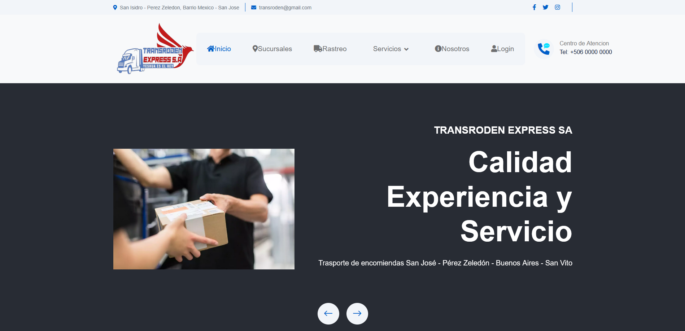
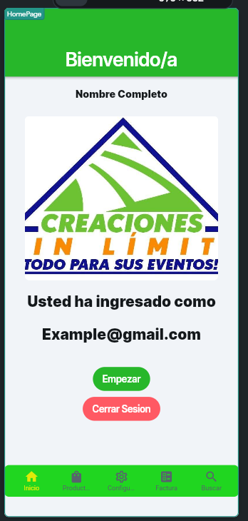
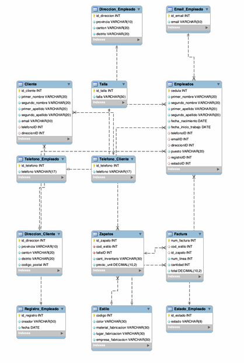
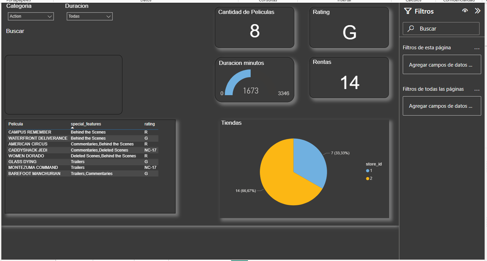
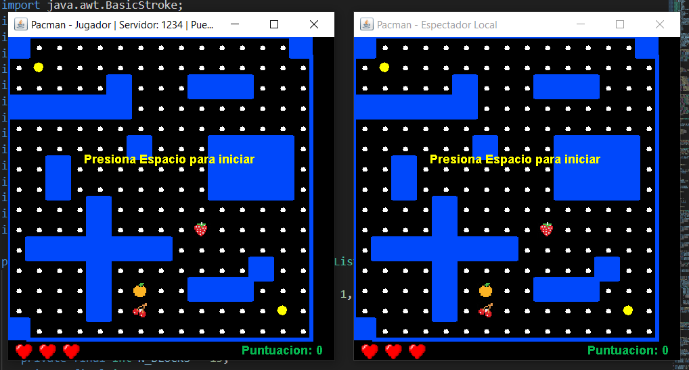
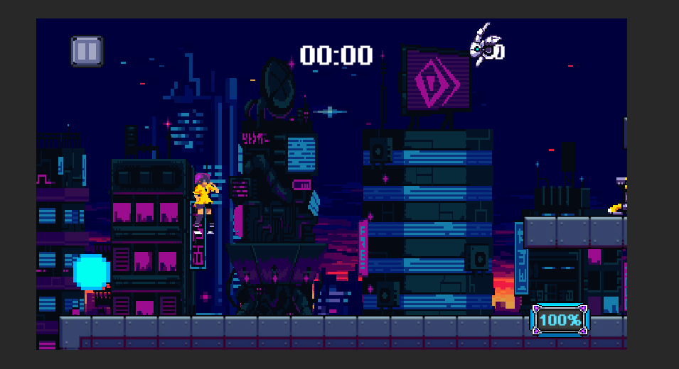
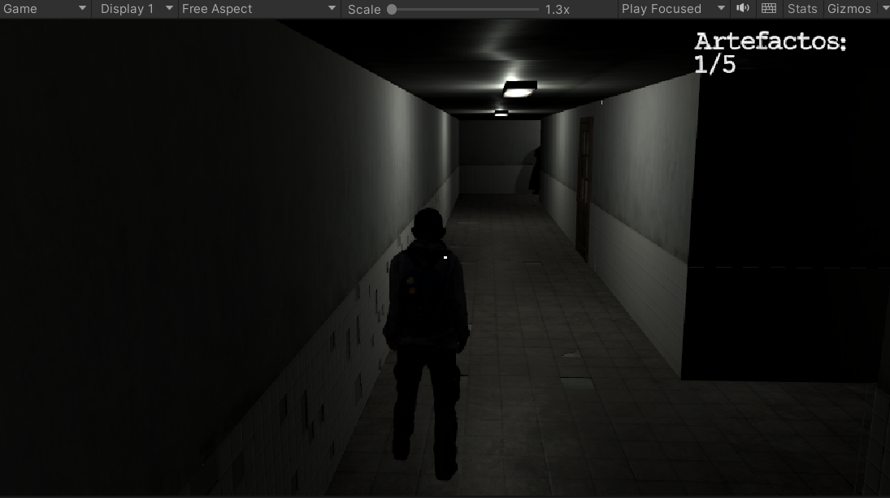

# anthonydip18como.github.io

<h1 align="center" >Hola, soy Anthony</h1>
<h2 align="center">Ingeniero en Sistemas Junior.</h3>
<h4 align="center">Me entusiasma aprender y adquirir nuevos conocimientos constantemente

Actualmente estoy expandiendo mi conocimiento en Ciberseguridad.

</h4>
<h3 align="center">Desarrollo de Software | Bases de Datos | Automatización | </h3>
<h5 align="center"> Contacto: AnthonyIbarrasPerez@gmail.com</h3>

---

## Lenguajes y Herramientas
- | Lenguajes de Programación: Python, Java, JavaScript, C++, C# y Unity y FlutterFlow
- | Desarrollo WEB: HTML, CSS y Node.js
- | Bases de datos: MySQL, Oracle, SQL Server y Diagramas E-R
- | Sistemas Operativos: Windows, Linux
- | Metodologías: Agile, Scrum, Waterfall y Desarrollo de Historias de Usuarios
- | TI y Auditorias: Conocimientos de documentación de TI y auditorias de Sistemas
- | Análisis Forense: Volatiliy Workbench, Autopsy
- | Control de Versiones: Experiencia con GitHub

---

## Mis Proyectos
<table width="1000">
  <tr>
    <td width="320">
      
    </td>
    <td width="680">
      <h3>TransrodenSA</h3>
      

        Sistema de gestión empresarial desarrollado para la administración de inventario,
        empleados y reportes. Desarrollado con base de datos SQL y aplicación de escritorio.
      

      

        <b>Tecnologías:</b> CSS, PHP, C#, MySQL, SQL Server Management
      

    </td>
  </tr>
</table>

<table width="1000">
  <tr>
    <td width="320">
      
    </td>
    <td width="680">
      <h3>Tienda Creacion Sin Limites</h3>
      

        Tienda Virtual de alquilieres de toldos, mesas y sillas para actividades. La tienda pose inicio de sesion,
        para que los usuarios puedan apartar y solicitar el alquiler de una manera sencilla.
      

      

        <b>Tecnologías:</b> Flutterflow, SQL, AndroidStudio
      

    </td>
  </tr>
</table>

<table width="1000">
  <tr>
    <td width="320">
      
    </td>
    <td width="680">
      <h3>Base de Datos de Tienda de Zapatos</h3>
      

        Base de datos para gestionar una tienda de zapatos con control de los clientes, empleados,
        productos, ventas, inventario, direcciones, telefonos y estados de los empleados.
      

      

        <b>Tecnologías:</b> MySQL, SQL Server Management, Diagramas ER
      

    </td>
  </tr>
</table>

<table width="1000">
  <tr>
    <td width="320">
      
    </td>
    <td width="680">
      <h3>Base de Datos de rentas de Peliculas</h3>
      

        Base de datos para realizar un alquileres de peliculas con filtros de busqueda. El dashboard fue
        desarrollado en Microsoft Power BI para visualizar y analizar información sobre películas y rentas.
      

      

        <b>Tecnologías:</b> Microsoft SQL Server, Power BI, Diagramas ER
      

    </td>
  </tr>
</table>

<table width="1000">
  <tr>
    <td width="320">
      
    </td>
    <td width="680">
      <h3>PacMan Java</h3>
      

        Se desarrollo el juego de PacMan en java completamente funcional. Este tiene un agregado de modo espectador
        utilizando JSP donde se puede observar la partida principal.
      

      

        <b>Tecnologías:</b> Java, Servlets/JSP
      

    </td>
  </tr>
</table>

<table width="1000">
  <tr>
    <td width="320">
      
    </td>
    <td width="680">
      <h3>Cyberworld</h3>
      

        Juego de plataformas 2D donde el jugador avanza por niveles evitando obstáculos,
        derrotando enemigos y recolectando objetos. Incluye sistema de físicas,
        colisiones, animaciones y sistema de puntuación.
      

      

        <b>Tecnologías:</b> Unity, C#, java
      

    </td>
  </tr>
</table>

<table width="1000">
  <tr>
    <td width="320">
      
    </td>
    <td width="680">
      <h3>Eeirie Enigma</h3>
      

        Juego 3D con movimiento en entorno tridimensional, control de cámara,
        interacción con objetos, físicas, colisiones e interfaz de usuario.
      

      

        <b>Tecnologías:</b> Unity / C# / Blender
      

    </td>
  </tr>
</table>

