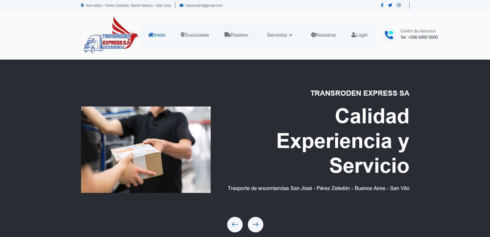
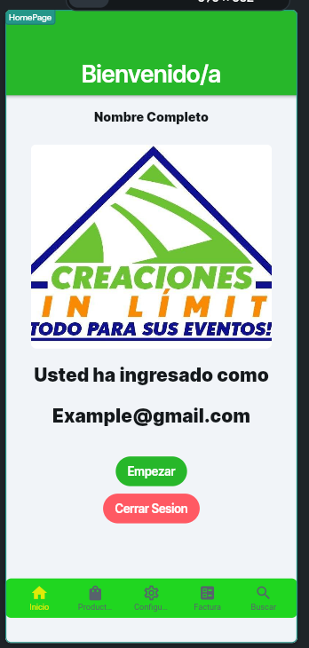
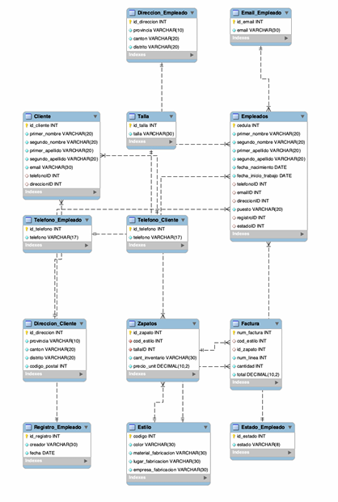
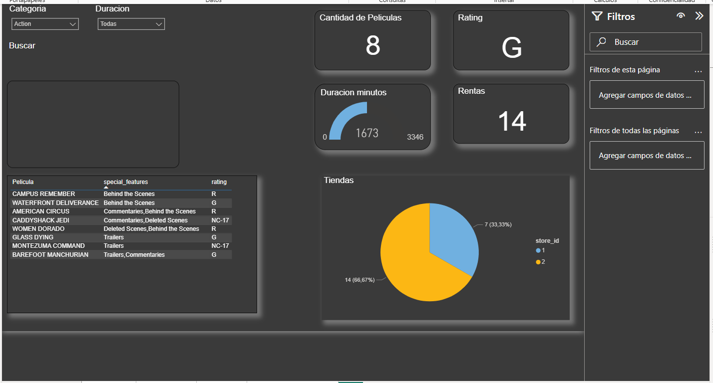
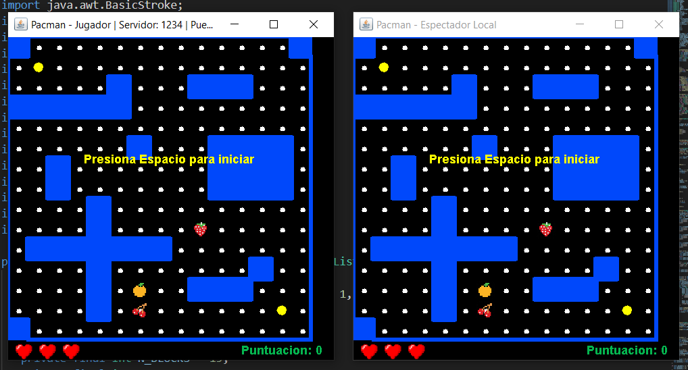
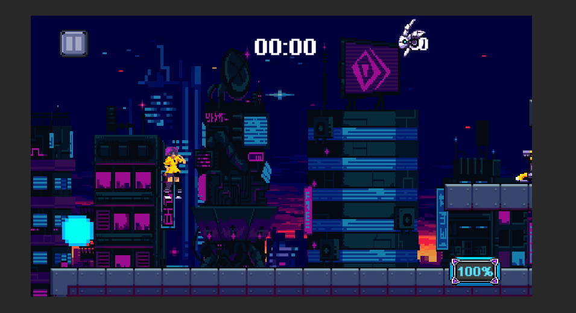
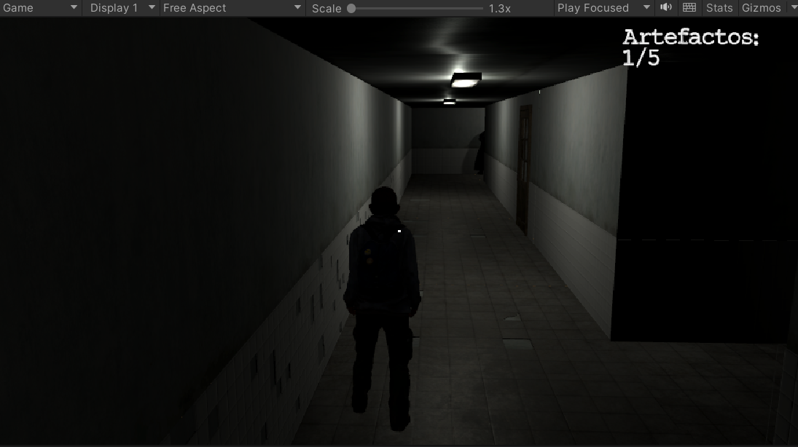

<h5>anthonydip18como.github.io</h5>

<h1 align="center">Hello, I'm Anthony</h1>
<h2 align="center">| Systems Engineer | Software Engineer |</h2>
<h4 align="center">
Passionate about learning and continuously expanding my knowledge.
<p style="color: #c9d1d9;">Currently expanding my knowledge in Cybersecurity.</p>
</h4>
<h3 align="center">Software Development | Databases | Automation</h3>
<h5 align="center">Contact: AnthonyIbarrasPerez@gmail.com</h5>

---

# Languages & Tools
- | Programming Languages: Python, Java, JavaScript, C++, C#, Unity, and FlutterFlow
- | Web Development: HTML, CSS, and Node.js
- | Databases: MySQL, Oracle, SQL Server, and E-R Diagrams
- | Operating Systems: Windows, Linux
- | Methodologies: Agile, Scrum, Waterfall, and User Story Development
- | IT & Auditing: Knowledge of IT documentation and Systems Auditing
- | Digital Forensics: Volatility Workbench, Autopsy
- | Version Control: Experience with GitHub

---

# My Projects
<table width="1000">
  <tr>
    <td width="320">
      
    </td>
    <td width="680">
      <h3> <a href="https://github.com/AnthonyDIP18/TransrodenSA" target="_blank"> TransrodenSA </a> </h3>
      <p>
        Business management system developed for inventory, employee, and report administration.
        Built with SQL databases and desktop application architecture.
      </p>
      <p>
        <b>Technologies:</b> CSS, PHP, C#, MySQL, SQL Server Management
      </p>
    </td>
  </tr>
</table>

<table width="1000">
  <tr>
    <td width="320">
      
    </td>
    <td width="680">
      <h3></h3>
      <h3> <a href="https://app.flutterflow.io/project/proyecto-tkkuje" target="_blank"> Creacion Sin Limites Store </a> </h3>
      <p>
        Virtual store for tent, table, and chair rentals for events. The platform includes login functionality,
        allowing users to reserve and request rentals easily.
      </p>
      <p>
        <b>Technologies:</b> FlutterFlow, SQL, Android Studio
      </p>
    </td>
  </tr>
</table>

<table width="1000">
  <tr>
    <td width="320">
      
    </td>
    <td width="680">
      <h3>Shoe Store Database</h3>
      <p>
        Database designed to manage a shoe store, including customer, employee, product,
        sales, inventory, addresses, phone numbers, and employee status management.
      </p>
      <p>
        <b>Technologies:</b> MySQL, SQL Server Management, ER Diagrams
      </p>
    </td>
  </tr>
</table>

<table width="1000">
  <tr>
    <td width="320">
      
    </td>
    <td width="680">
      <h3>Movie Rental Database</h3>
      <p>
        Database for managing movie rentals with search filters. The dashboard was developed in Microsoft Power BI
        to visualize and analyze movie and rental information.
      </p>
      <p>
        <b>Technologies:</b> Microsoft SQL Server, Power BI, ER Diagrams
      </p>
    </td>
  </tr>
</table>

<table width="1000">
  <tr>
    <td width="320">
      
    </td>
    <td width="680">
      <h3> <a href="https://github.com/AnthonyDIP18/PacManJava" target="_blank"> PacMan Java </a> </h3>
      <p>
        Fully functional PacMan game developed in Java. Includes an additional spectator mode
        using JSP, where users can observe the main gameplay.
      </p>
      <p>
        <b>Technologies:</b> Java, Servlets/JSP
      </p>
    </td>
  </tr>
</table>

<table width="1000">
  <tr>
    <td width="320">
      
    </td>
    <td width="680">
  <h3> <a href="https://github.com/AnthonyDIP18/CyberChase" target="_blank"> Cyber chase </a> </h3>
      <p>
        2D platform game where the player advances through levels while avoiding obstacles,
        defeating enemies, and collecting items. Includes physics, collision detection,
        animations, and a scoring system.
      </p>
      <p>
        <b>Technologies:</b> Unity, C#, Java
      </p>
    </td>
  </tr>
</table>

<table width="1000">
  <tr>
    <td width="320">
      
    </td>
    <td width="680">
      <h3> <a href="https://github.com/AnthonyDIP18/EerieEnigma" target="_blank"> Eerie Enigma </a> </h3>
      <p>
        3D game featuring movement in a three-dimensional environment, camera controls,
        object interaction, physics, collision detection, and user interface systems.
      </p>
      <p>
        <b>Technologies:</b> Unity / C# / Blender
      </p>
    </td>
  </tr>
</table>
```
